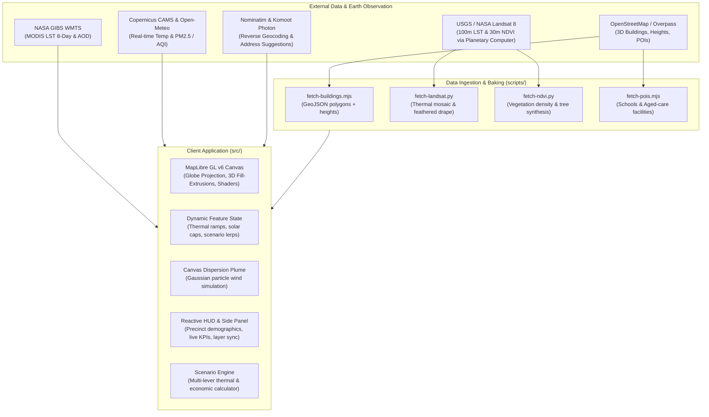

# TerraGrid 3D — Urban Climate Resilience & Heat Digital Twin

[](https://github.com/AranyaMaji/TerraGrid-3D)
[](LICENSE)
[](https://vitejs.dev/)
[](https://maplibre.org/)

> **3D urban heat and climate resilience digital twin for municipal councils.**  
> Blending satellite radiometry, atmospheric physics, and 3D urban topology to diagnose heat vulnerability, trace industrial particulate plumes, and simulate cool-roof and urban canopy interventions with live impact KPIs.

Built for the **EU / MLAI Climate Hack-tion 2026** (Track 3: Resilient Cities & Buildings).

---

## Overview & Problem Statement

Urban Heat Islands (UHIs) cause urban centres to experience surface temperatures up to 10–15 °C higher than surrounding rural baselines. Extreme surface heat combined with particulate air pollution creates acute health hazards for vulnerable demographics (children and elderly residents in aged-care facilities) and drives severe peaks in electrical grid demand for cooling.

Most municipal climate tools remain trapped in static 2D GIS heat maps or slow offline simulation packages that require days to compute. **TerraGrid 3D** delivers a web-based, real-time 3D digital twin combining:

- **100 m satellite thermal radiometry** (Landsat 8 TIRS) directly applied to individual 3D building envelopes.
- **Atmospheric hazard dispersion** (Copernicus CAMS particulate forecasts + NASA GIBS aerosol data + real-time animated Gaussian smoke plumes).
- **Urban demographic overlays** (Census age-vulnerability, school facilities, and aged-care centers).
- **Rapid scenario simulation** allowing planners to test high-albedo cool roofs, urban canopy expansion, and rooftop solar arrays with instant quantitative feedback on temperature reduction, peak AC demand mitigation, and energy cost savings.

---

## Key Features

### 1. Multi-City 3D Built Environment
- Pre-baked LOD1 extruded 3D building geometry from OpenStreetMap across five distinct urban microclimates:
  - **Parramatta, Australia**: Western Sydney’s acute inland heat basin.
  - **Sydney CBD & Harbour, Australia**: High-density coastal commercial corridor.
  - **Melbourne CBD, Australia**: Temperate urban canyon environment.
  - **Central London, United Kingdom**: Historic European high-density core.
  - **Suva, Fiji**: Vulnerable Pacific Island coastal capital.
- Smooth multi-scale navigation: Pulls back to an interactive spinning globe, dynamically handles level-of-detail transitions, and dives into high-resolution 3D street views.

### 2. True Remote Sensing Radiometry
- **Landsat 8 Level 2 Surface Temperature**: 100 m thermal infrared sensor data covering Greater Sydney, edge-feathered to seamlessly integrate with regional baselines.
- **Footprint-Specific Thermal Assignment**: Individual building polygons are assigned radiometric surface temperatures derived from satellite observation.
- **Calibrated Diverging Thermal Ramp**: A thermal-camera spectrum (slate blue $\rightarrow$ yellow $\rightarrow$ thermal red) mapped over $\pm 1.5$ °C relative to the urban baseline, with height damping for tall towers to minimize boundary-layer bias.
- **NASA GIBS MODIS LST**: Global 8-day composite Land Surface Temperature drape providing regional and global thermal context.

### 3. Composable Environmental Hazard Layers
All layers can be activated simultaneously or isolated with dedicated toggle chips:
- **Surface Heat**: Real radiometric surface temperatures highlighting high-emissivity rooftops and asphalt heat traps.
- **Smoke & Particulate Aerosols**: Combines NASA GIBS Aerosol Optical Depth (AOD) with live Copernicus CAMS PM2.5 / AQI forecasts and an animated real-time Gaussian dispersion smoke plume mapped from actual industrial point sources (e.g., Camellia industrial corridor).
- **Tree Canopy & Urban Forest**: 30 m Landsat NDVI vegetation drape coupled with dynamically generated 3D volumetric tree canopy crowns grown on vegetated urban pixels.
- **Rooftop Solar Potential**: Computes usable building roof footprint area $\times$ local solar irradiance constants to project annual clean power yield (MWh/yr).

### 4. Precinct Vulnerability & Critical Infrastructure
- **Census Demographics**: Suburb-level overlays tracking population density, vulnerable elderly cohorts (Age 65+), and school counts.
- **Point of Interest (POI) Inspection**: Real-world schools and aged-care facilities with interactive hover pills displaying local surface temperature anomalies relative to the precinct average.
- **3D Building Inspector**: Click any building to reverse-geocode the street address (via Nominatim), retrieve building height, thermal variance, and solar yield.
- **Global Address Search**: Instant geocoding with Photon suggestions, automatic city detection, and 3D camera transitions.

### 5. Urban Cooling Scenario Simulator ("Test Canopy Scenario")
- **Interactive Resilience Levers**:
  - **Cool Roofs**: High-albedo reflective coatings applied to building envelopes.
  - **Tree Canopy**: Strategic street-tree and urban forest expansion.
  - **Rooftop Solar**: Photovoltaic deployment across suitable roof areas.
- **Dynamic Coverage Slider**: Scale adoption from 0% to 100% with real-time smooth colour transitions on 3D building models.
- **Live Quantified KPIs**:
  - $\Delta$ Surface Temperature (°C reduction)
  - Peak Air-Conditioning Demand Reduction (%)
  - Clean Renewable Solar Energy Generated (MWh/year)
  - Municipal & Residential Energy Cost Savings ($/year)
- **One-Click Council Brief Export**: Formats the scenario results and KPIs into a printable/exportable PDF council report.

---

## Architecture & Data Flow



---

## Data Sources & Attribution

| Dataset / Service | Provider | Purpose in TerraGrid 3D |
| :--- | :--- | :--- |
| **Landsat 8 Collection 2 (TIRS / OLI)** | USGS / NASA / Microsoft Planetary Computer | 100 m thermal surface temperature (LST) and 30 m NDVI vegetation drape |
| **MODIS Terra / Aqua** | NASA GIBS | Global 8-day composite Land Surface Temperature & Aerosol Optical Depth (AOD) |
| **Copernicus Atmosphere (CAMS)** | ECMWF / Copernicus via Open-Meteo | Real-time atmospheric PM2.5, air quality index, and live 2 m ambient temperatures |
| **OpenStreetMap & Overpass** | OpenStreetMap Contributors | 3D building outlines, heights, levels, schools, and aged-care facilities |
| **OpenFreeMap Liberty** | OpenFreeMap / MapLibre | Keyless high-performance vector basemap tiles |
| **Nominatim & Photon** | OpenStreetMap / Komoot | Reverse address geocoding on building clicks and instant address autocompletion |

---

## Quickstart & Local Setup

### Prerequisites
- Node.js (v18 or higher recommended)
- Modern Chromium browser (Google Chrome, Microsoft Edge, or Brave)

### Installation

```bash
# Clone the repository
git clone https://github.com/AranyaMaji/TerraGrid-3D.git
cd TerraGrid-3D

# Install dependencies (only vite and maplibre-gl)
npm install

# Start local development server
npm run dev
```

Open the displayed localhost URL (typically `http://localhost:5173`) in Chrome.

### Production Build

```bash
# Build production bundle to dist/
npm run build

# Preview production build locally
npm run preview
```

---

## Keyboard & Interaction Shortcuts

- **Click Any Building**: Inspect street address, building height, thermal differential vs local average, and solar yield.
- **Click Any Precinct**: Focus camera on neighbourhood, display demographic breakdown and precinct-specific environmental readings.
- **Search Bar**: Type any suburb, city, or street address to jump directly to it with smooth flight.
- **2D / 3D Toggle**: Switch camera pitch between planar top-down view (0°) and isometric 3D perspective (60°).
- **Layer Chips**: Toggle or combine Heat, Smoke, Canopy, and Solar layers at will.
- **Test Canopy Scenario**: Open scenario card to simulate resilience interventions and export a council brief.

---

## Repository Structure

```
├── data/                      # Baked building geometries, thermal rasters & POIs
│   ├── buildings-*.geojson    # 3D building footprints & heights for each city
│   ├── lst-landsat*.png       # 100m feathered thermal surface temperature drapes
│   ├── ndvi-landsat*.png      # 30m NDVI vegetation drapes
│   ├── pois.geojson           # Verified schools and aged-care facilities
│   └── precincts.geojson      # Municipal precinct boundaries & census data
├── docs/                      # Technical notes, API verification, hackathon specs
│   ├── API-NOTES.md           # Endpoints, queries, and projection parameters
│   ├── design-reference.png   # Design system reference
│   └── hackathon/             # Competition briefing, tracks, and resources
├── scripts/                   # Data extraction and pre-baking pipelines
│   ├── fetch-buildings.mjs    # OSM Overpass building polygon harvester
│   ├── fetch-landsat.py       # Planetary Computer Landsat LST processor
│   ├── fetch-ndvi.py          # Landsat NDVI and 3D tree crown generator
│   └── fetch-pois.mjs         # Nominatim/OSM POI harvester
├── src/                       # Application source code
│   ├── main.js                # Core digital twin engine (MapLibre, state, HUD, simulation)
│   └── style.css              # Technical UI design tokens & layout
├── index.html                 # Single-page application shell
├── package.json               # Lightweight dependency manifest
├── CHANGELOG.md               # Shipped features log
├── TODO.md                    # Roadmap and feature tracker
└── LICENSE                    # MIT License
```

---

## Production path

The retrofit program (offer letters, owner applications, stage tracking) keeps its status in the browser for the demo.
In production:

- Letters go to the owner's address from the council's rates records, and ownership is confirmed before any work or payment.
- The council view sits behind a staff login.
- Payment waits for the installer's invoice and the next Landsat pass showing the roof running cooler.

---

## License

This project is licensed under the [MIT License](LICENSE).
