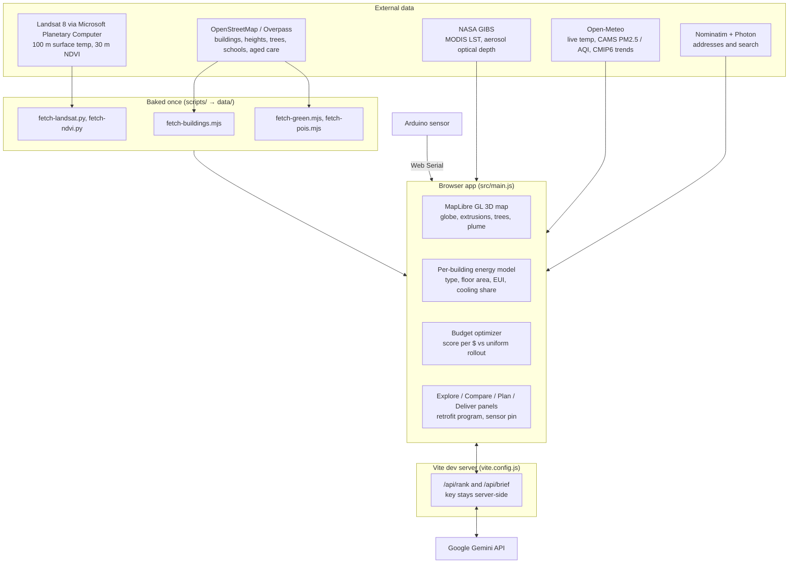

# TerraGrid 3D — Urban Heat Retrofit Planner

### TerraGrid 3D. From hundreds of pages to a plan a council can fund on Monday.

[](https://github.com/AranyaMaji/TerraGrid-3D)
[](LICENSE)
[](https://vitejs.dev/)
[](https://maplibre.org/)

> **A 3D digital twin that shows a council which roofs are costing its residents the most in heat, and which retrofits to fund first.**

Built for the **EU / MLAI Climate Hack-tion 2026**, Track 3: Resilient Cities & Buildings.

---

## The problem

Western Sydney summers run 10 °C+ hotter than the coast. Dark roofs and bare streets push surface temperatures past 50 °C, drive up air-conditioning bills and peak grid demand, and hit the people least able to cope: children in schools, older residents, aged-care homes.

Councils have money for cool roofs, trees and solar, but no fast way to answer: *which buildings first, and what does each dollar buy?* Their tools are static 2D heat maps or consultant studies that take weeks.

## What TerraGrid 3D does

One page, four steps, built on public satellite and building data for five cities (Parramatta, Sydney CBD, Melbourne CBD, Central London, Suva in Fiji):

1. **Explore** — fly from a globe into the city. Every building is coloured by its estimated roof heat. Toggle surface heat, smoke and PM2.5, tree canopy and solar potential, alone or together. Click any building or precinct for its numbers.
2. **Compare** — rank every precinct by extra cooling cost, roof heat or vulnerable residents. Switch between **Now, 2030 and 2050** to see how warming changes the ranking.
3. **Plan** — pick from six retrofit measures (cool roofs, trees, rooftop solar, insulation, efficient HVAC, smart controls), set a budget, and choose a priority (biggest savings, fastest payback, protect vulnerable, balanced). The optimizer funds the best roofs first and shows savings per year, payback, upfront cost, MWh, CO₂ avoided, and how much better it does than a uniform rollout. Gemini recommends the top 3 measures for that suburb with a reason each.
4. **Deliver** — generate a one-page council brief (hazard, funded plan, return on investment), then run the **retrofit program**: send coded offer letters to owners of the funded buildings, let owners apply from the public map, and track each roof from Offered to Verified.

A **street sensor** (Arduino over Web Serial) drops a live temperature pin on the map and compares it with the weather model.

---

## Quickstart

Needs Node.js 18+ and Chrome (or another Chromium browser).

```bash
git clone https://github.com/AranyaMaji/TerraGrid-3D.git
cd TerraGrid-3D
npm install
npm run dev
```

Open the printed URL (usually `http://localhost:5173`). Everything works without any keys.

**Optional — live Gemini features.** The AI ranking and council brief call Gemini through the dev server, so the key never reaches the browser. Without a key they fall back to a built-in ranking and a template brief.

```bash
GEMINI_API_KEY=your-key npm run dev
```

`GEMINI_MODEL` overrides the model (default `gemini-3.5-flash-lite`).

**Optional — street sensor.** Flash `arduino/sensor/sensor.ino` to an Arduino Uno with a DS18B20 module on A0 (wiring in the file header), close the Serial Monitor, then click **Sensor** in the app and pick the port. Without a board the pin shows a modelled reading.

The dev server also tries to start a Cloudflare tunnel used for our team preview. If `cloudflared` is not installed it prints a warning and carries on.

Production build: `npm run build`, then `npm run preview`.

---

## Architecture



### How the numbers are made

- **Roof heat** starts from Landsat 8 surface temperature where a scene is baked, otherwise from regional heat and footprint, height and green-space proxies, compared with the area average.
- **Energy and cost** come from a per-building model: building type from OSM, floor area from footprint × levels, typical energy use per m² for that type (NABERS / CBECS-style medians), and the share of it that goes to cooling. Local heat above the reference station adds cooling load.
- **Retrofit savings** apply typical reductions per measure to each building, priced by area. The optimizer fills the budget greedily by priority score per dollar.
- **2030 / 2050** warm every roof by the city's summer-max trend, the mean of 7 CMIP6 HighResMIP models from the Open-Meteo Climate API.
- **Gemini only orders and explains.** It receives the computed totals and is told to quote them exactly and invent no figures.

All figures are modelled planning estimates, not measurements or audits. Some demo-area inputs are compiled by the team.

---

## Repository layout

```
├── index.html            Single-page app shell
├── src/main.js           Map, layers, energy model, optimizer, panels, program, sensor
├── src/style.css         Design tokens and layout
├── vite.config.js        Dev server: Gemini proxy (/api/rank, /api/brief), preview tunnel
├── data/                 Baked buildings, trees, POIs, precincts, Landsat rasters
├── scripts/              One-off fetchers that produced data/
├── arduino/sensor/       Street sensor sketch
├── docs/                 API notes, design reference, hackathon brief
├── CHANGELOG.md          What shipped, item by item
└── TODO.md               Build order
```

---

## Third-party & AI tools disclosure

### AI tools

| Tool | How we used it |
| :--- | :--- |
| **Claude Code** (Anthropic, Claude Opus models) | Main coding assistant. Wrote most of the code, the data scripts and these docs, working from our task list, design and decisions. Every change was reviewed and checked in the browser by the team. |
| **OpenAI Codex** | Coding assistant for some build sessions, same workflow as above. |
| **Google Gemini API** (`gemini-3.5-flash-lite`) | Runs inside the app. Ranks the top 3 retrofit measures per suburb and writes the council brief text from numbers the app computed. |

No AI-generated images or datasets are used. All data comes from the sources below.

### Libraries

| Library | License | Use |
| :--- | :--- | :--- |
| [MapLibre GL JS](https://maplibre.org/) 6 | BSD-3-Clause | 3D map rendering |
| [Vite](https://vitejs.dev/) 8 | MIT | Dev server and build |
| [Inter](https://fonts.google.com/specimen/Inter) (Google Fonts) | OFL | UI font |

The Landsat bake scripts also use [Pillow](https://python-pillow.org/) (MIT-CMU). They are not needed to run the app.

### Data and services

| Source | Provider | Use |
| :--- | :--- | :--- |
| Landsat 8 Collection 2 L2 (surface temperature, NDVI) | USGS / NASA, via Microsoft Planetary Computer | Roof heat and vegetation drapes |
| MODIS LST and aerosol optical depth | NASA GIBS | Regional heat and smoke context |
| Weather, CAMS air quality, CMIP6 climate trends | Open-Meteo (data from ECMWF / Copernicus and CMIP6 models) | Live temperature, PM2.5 / AQI, 2030 / 2050 projections |
| Buildings, heights, trees, parks, schools, aged care | © OpenStreetMap contributors (ODbL), via Overpass | 3D city, trees, vulnerable sites |
| Basemap tiles | OpenFreeMap | Vector basemap |
| Geocoding and search | Nominatim (OSM), Photon (Komoot) | Building addresses, address search |
| Precinct outlines, residents, age 65+ share, tree cover | Compiled by the team for each demo area (`data/precincts.geojson`) | Precinct panel and vulnerability weighting |

---

## License

Code is [MIT](LICENSE). Map data © OpenStreetMap contributors, available under the ODbL.
